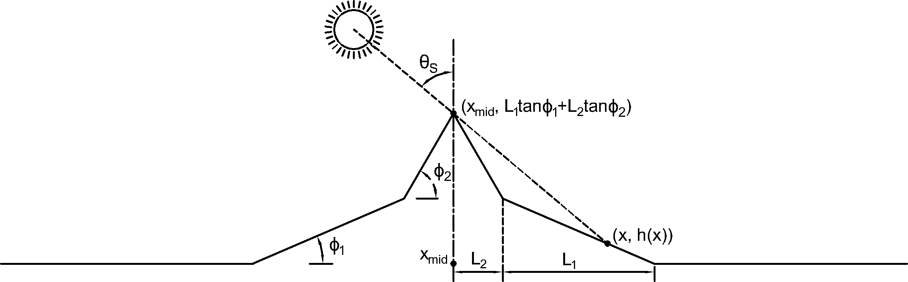

# SlopeFlow
Models for slope flows, particularly downslope, drainage flows.

## Set up
To set up:
```
git clone https://github.com/adconnolly/SlopeFlow.git
cd SlopeFlow
source bashWRFV3 # Designed for Berkeley Research Computing's machine, Savio
wget https://github.com/NCAR/WRFV3/archive/refs/tags/V3.9.1.1.tar.gz
tar -xvzf WRFV3-3.9.1.1.tar.gz && mv WRFV3-3.9.1.1 WRFV3
cp -a WRFV3_SlopeFlow/. WRFV3/
cd WRFV3
./compile -j 1 em_les |& tee compile.log
```

## New LES
To create a directory in which a new large-eddy simulation may be run, use shell script provided WRFV3_SlopeFlow/new_LES.sh within that directory.
```
sh new_LES.sh
```
The namelist in the newLES/ directory is the same as WRFV3_SlopeFlow/test/em_les/namelist.input and accompanied with the tables in the original run/ directory required for the soil model to be used in these ideal configurations. This can be toggled with the ideal_soil namelist option. Different compound-slope mountain geometries can be configured with the following namelist options: 
```
ideal_terrain	= 4, 
slope1		 = 3,
fetch1		 = 3000,
slope2		 = 5,
fetch2 		 = 1000,
```
where the subscript 1 corresponds to the foothills and the subscript 2 corresponds to the peak.

## Fixes
A number of fixes are required to compile this older version of WRF, V3.9.1.1, on a newer machine. 
First, the Intel Compiler Classic (icc) is deprecated. To address this, the configure.wrf included here has been changed from one generated by configure with options 15, Intel, and 1, basic nesting, selected. We replace icc with icx using an older standard for compatibility. The relevant portions of the diff output: 
```
153,154c153,154
< SCC             =       icx -std=gnu89
< CCOMP           =       icx -std=gnu89
---
> SCC             =       icc
> CCOMP           =       icc
```
Second, the library rpc is no longer available in the typical location within (```/usr/include/```), rather it is one level deeper in (```/usr/include/tirpc/```). We direct the compiler to the required files by modifying configure.wrf to link to this library with an additional flag:
```
LIB_EXTERNAL    = ... -ltirpc ...
```
This library is only used in (```share/landread.o```) so, we modify it,
```
68,69c68,69
< #include <tirpc/rpc/types.h>
< #include <tirpc/rpc/xdr.h>
---
> #include <rpc/types.h>
> #include <rpc/xdr.h>
```
and add to the bottom of (```share/Makefile```):
```
107d106
< landread.o: CFLAGS += -I/usr/include/tirpc -D__TIRPC__
```
A final fix relates to the NetCDF C library and its Fortran library having different paths, at least in Savio's file tree. We keep the Fortran library path as the environment variable (```$NETCDF```) but add another, e.g.
``` export NETCDF_C="/global/software/rocky-8.x86_64/intel/linux-rocky8-x86_64/oneapi-2023.1.0/netcdf-c-4.9.2-ou2g5zqm4wyuw7djuz46rfmg36gn6mnv" ```
to make use of it in (```external/io_netcdf/Makefile```)
```
< LIBS    =  $(LIB_LOCAL) -L$(NETCDF_C)/lib             -lnetcdf
< LIBFFS  =               -L$(NETCDFPATH)/lib -lnetcdff          $(NETCDF4_DEP_LIB)
```
and append both to the compilation.
